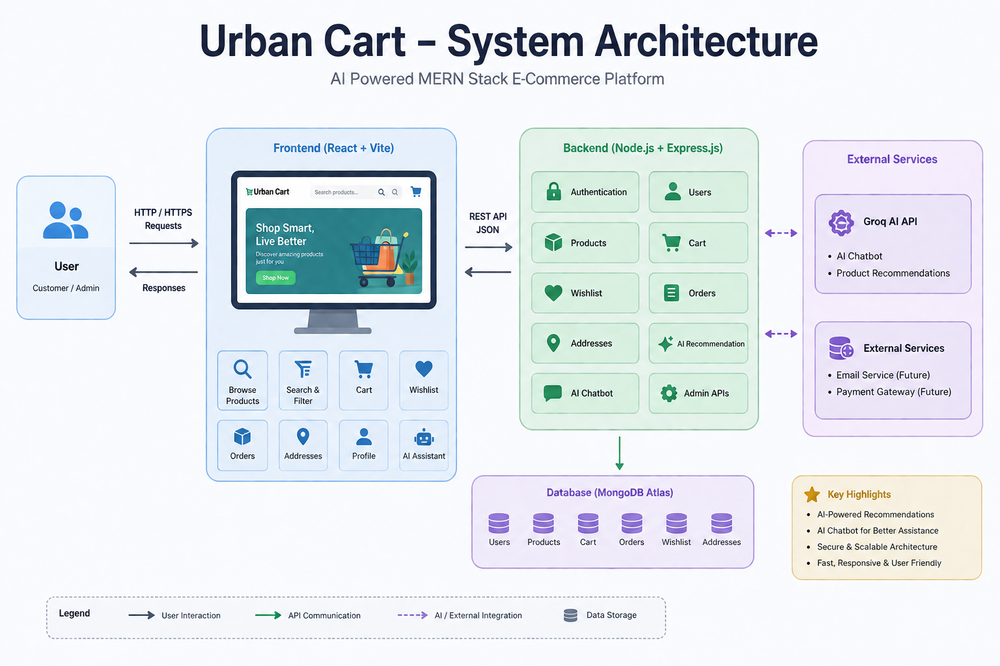
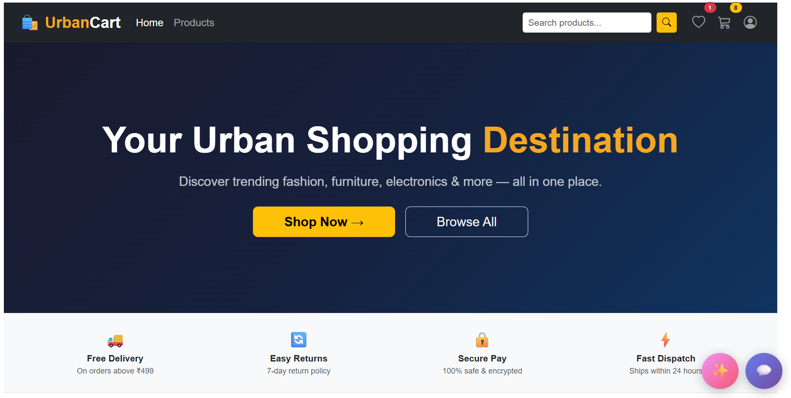
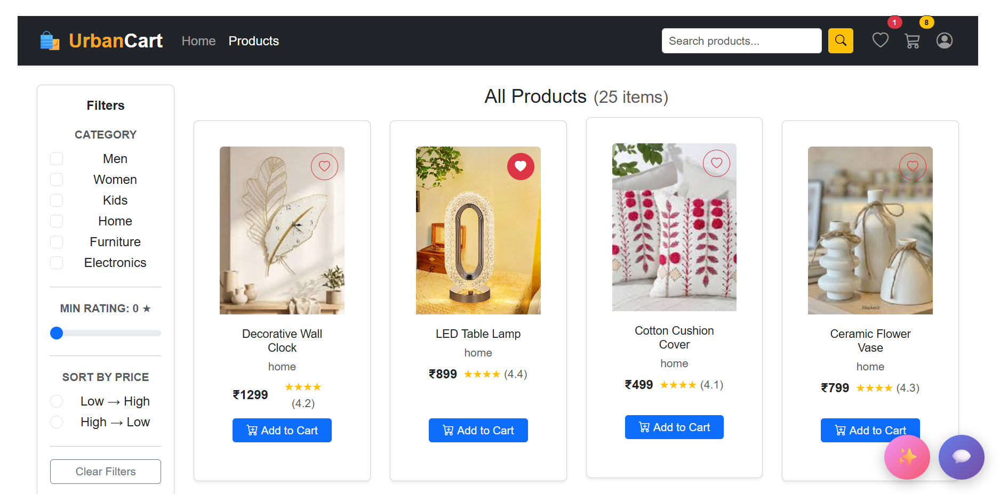
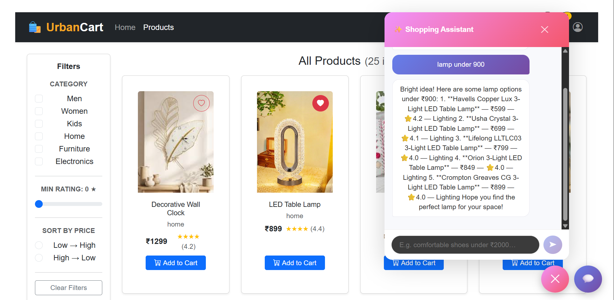

# Urban Cart: MERN Stack E-Commerce Web Application

# Problem Statement

In today's online shopping experience, users often struggle to quickly find relevant products, manage their shopping efficiently, and receive personalized assistance while browsing. Traditional e-commerce platforms also lack intelligent features that enhance user interaction and improve the overall shopping experience.

Urban Cart aims to solve these challenges by providing a modern MERN stack based e-commerce platform with an intuitive interface, efficient product management, and AI-powered shopping assistance.

# Features
 Browse products by category
 Search and filter products
 Add and manage Wishlist
 Shopping Cart functionality
 Address Management
 Order Placement
 User Authentication (JWT & bcrypt)
 Fully Responsive UI
 AI-Powered Product Recommendation System
 AI-Powered Customer Support Chatbot

# System Architecture

 # Tech Stack
   ## Frontend
   React.js
   Bootstrap
   React Router
   Context API
   
  ## Backend
   Node.js
   Express.js
   
  ## Database
   MongoDB
   Mongoose

  ## Authentication
   JWT (JSON Web Token)
   bcrypt
   
  ## AI Integration
   Groq API

# 📸 Project Screenshots

## 🏠 Home Page

## 🛍 Products Page

## 🤖 AI Shopping Assistant

# Live Demo
urban-cart-niv9.vercel.app

# Project Structure
UrbanCart
│
├── Backend
│   ├── models
│   ├── data
│   ├── db
│   ├── ai
│   ├── scripts
│   ├── index.js
│   └── package.json
│
├── Frontend
│   └── majorProject
│       ├── src
│       ├── public
│       ├── package.json
│       └── vite.config.js
│
└── README.md

# Key Highlights

- MERN Stack Architecture
- RESTful API Development
- MongoDB Atlas Integration
- Secure JWT Authentication
- AI-Powered Shopping Experience
- Responsive UI for Desktop and Mobile
- Context API State Management
- Modular Project Structure

# Connect With Me
- 💼 **LinkedIn:** https://www.linkedin.com/in/mishikamendiratta/
- 💻 **GitHub:** https://github.com/mishika2004
- 📧 **Email:** mishikamendiratta@gmail.com

# ⭐ Show Your Support
If you found this project useful or interesting, please consider giving it a **⭐ Star** on GitHub.
